# 🛡️ Enterprise Software Supply Chain Security Auditor (ESSCSA)
### *Defensive Dependency Vulnerability Auditor & Compliance Inspector (OWASP A06:2021, NIST SP 800-161 & SLSA v1.0)*

---

```
 ███████╗███████╗███████╗ ██████╗███████╗ █████╗ 
 ██╔════╝██╔════╝██╔════╝██╔════╝██╔════╝██╔══██╗
 █████╗  ███████╗███████╗██║     ███████╗███████║
 ██╔══╝  ╚════██║╚════██║██║     ╚════██║██╔══██║
 ███████╗███████║███████║╚██████╗███████║██║  ██║
 ╚══════╝╚══════╝╚══════╝ ╚═════╝╚══════╝╚═╝  ╚═╝
```

---

## 📖 TABLA DE CONTENIDOS

1. [Introducción y Objetivos](#-introducción-y-objetivos)
2. [Alineación con Estándares Internacionales (NIST & SLSA & OWASP)](#-alineación-con-estándares-internacionales-nist--slsa--owasp)
3. [Advertencia Legal y Escaneo Defensivo Seguro](#-advertencia-legal-y-escaneo-defensivo-seguro)
4. [Mermaid: Arquitectura de Componentes y Flujo de Control](#-mermaid-arquitectura-de-componentes-y-flujo-de-control)
5. [Estructura Física del Proyecto](#-estructura-física-del-proyecto)
6. [Instalación y Aprovisionamiento](#-instalación-y-aprovisionamiento)
7. [Guía Completa de Operación](#-guía-completa-de-operación)
8. [Detalle y Mapeo de Reportes (Excel Multihidra)](#-detalle-y-mapeo-de-reportes-excel-multihidra)
9. [Fórmula de Riesgo y Scoring Ponderado](#-fórmula-de-riesgo-y-scoring-ponderado)
10. [Integración en DevSecOps (CI/CD Pipeline)](#-integración-en-devsecops-cicd-pipeline)
11. [Contenedores de Producción (Dockerfile)](#-contenedores-de-producción-dockerfile)
12. [Guía de Extensibilidad (Añadir Reglas en 3 Minutos)](#-guía-de-extensibilidad-añadir-reglas-en-3-minutos)
13. [Resolución de Problemas (Troubleshooting)](#-resolución-de-problemas-troubleshooting)
14. [Suite de Pruebas y Aseguramiento](#-suite-de-pruebas-y-aseguramiento)

---

## 📖 Introducción y Objetivos

El **Enterprise Software Supply Chain Security Auditor (ESSCSA)** es un motor estático de ciberseguridad defensiva automatizado de nivel industrial. Su objetivo primordial es auditar la superficie de riesgo en la cadena de suministro de software (*Software Supply Chain Security*), analizando de forma segura los archivos de dependencias de múltiples ecosistemas, calculando vectores de riesgo cuantitativos y emitiendo planes de remediación y mitigación ordenados por severidad.

Esta solución está diseñada bajo los estrictos estándares de **Clean Architecture** y principios **SOLID**, garantizando un total aislamiento de las reglas de negocio respecto a librerías de infraestructura. ESSCSA se integra de forma fluida en pipelines de **DevSecOps**, permitiendo a los ingenieros de calidad técnica (QA), desarrolladores y analistas de ciberseguridad auditar de forma local y determinista la salud de sus dependencias antes de cada despliegue a producción.

---

## 📋 Alineación con Estándares Internacionales (NIST & SLSA & OWASP)

La herramienta mapea de forma nativa los hallazgos y auditorías contra los marcos de cumplimiento y buenas prácticas de seguridad de software más importantes del mundo:

| Servicio del Scanner | Referencia de Control | Objetivo de Cumplimiento Normativo | Severidad |
| :--- | :--- | :--- | :--- |
| **`vulnerability_analyzer_service.py`** | **OWASP A06:2021** | Identificar componentes vulnerables y desactualizados consultando de forma pasiva la base de inteligencia de *OSV.dev*. | **Crítica / Alta** |
| **`insecure_version_rule_service.py`** | **NIST SP 800-161 (SCRM)** | Validar configuraciones de versiones inseguras, prohibiendo comodines (`*`, `latest`) o rangos abiertos (`>=`). | **Media** |
| **`abandoned_dependency_analyzer_service.py`** | **SLSA v1.0 (Integrity)** | Identificar dependencias deprecadas, descontinuadas o sin mantenimiento activo que elevan el riesgo de zero-day. | **Alta** |
| **`dependency_normalizer_service.py`** | **CycloneDX / SBOM** | Consolidar y de-duplicar dependencias directas e indirectas transitivas, produciendo un inventario determinista. | **Informativa** |
| **`outdated_dependency_analyzer_service.py`** | **Deuda Técnica** | Calcular la distancia de actualización (MAJOR, MINOR, PATCH) evaluando el riesgo y breaking changes potenciales. | **Baja** |

---

## ⚠️ Advertencia Legal y Escaneo Defensivo Seguro

> [!WARNING]
> **AUDITORÍA DE SEGURIDAD ESTRICTAMENTE DEFENSIVA Y AUTORIZADA:** El uso de este software para auditar repositorios o arquitecturas sin la debida autorización explícita y firmada por el propietario legal se considera una actividad ilícita. Los desarrolladores no asumen ninguna responsabilidad por daños directos, indirectos o colaterales derivados de su utilización.

### Reglas de Escaneo Seguro y Defensivo de ESSCSA:
* **GET Pasivo e Inteligencia Local:** El scanner jamás envía código fuente, archivos completos o secretos a APIs de terceros. Solo consulta de forma pasiva enviando el nombre del paquete, la versión y el ecosistema a bases de datos públicas.
* **Sin payloads ofensivos:** No realiza ejecución de código remoto (RCE), inyecciones de dependencias hostiles, descargas automáticas no autorizadas ni alteraciones físicas de los manifiestos analizados.
* **Evasión de Rate-Limiting:** Implementa lógica secuencial, caching interno por consulta única y límites de espera ajustables (`TIMEOUT_SECONDS`) para evitar bloqueos por parte de los registros oficiales.
* **Hardening de Secretos:** Cualquier clave de API o variable sensible (como `GITHUB_TOKEN` o `NVD_API_KEY`) se enmascara en memoria y jamás se expone en consola o reportes físicos.

---

## 🗺️ Mermaid: Arquitectura de Componentes y Flujo de Control

El diseño de ESSCSA sigue el patrón de **Clean Architecture** aplicando **Inversión de Control** de tal manera que el núcleo lógico (Dominio y Aplicación) no tiene dependencias de librerías del framework o de infraestructura:

```mermaid
graph TD
    subgraph Presentacion_Infraestructura [Presentación e Infraestructura Adapters]
        CLI[app/presentation/cli.py]
        OsvProvider[app/infrastructure/providers/osv_vulnerability_provider.py]
        ExcelExporter[app/infrastructure/exporters/excel_report_exporter.py]
        JsonExporter[app/infrastructure/exporters/json_report_exporter.py]
        PdfExporter[app/infrastructure/exporters/pdf_report_exporter.py]
        DirectoryManager[app/infrastructure/filesystem/directory_manager.py]
    end

    subgraph Aplicacion [Lógica de Aplicación - Interfaces y Casos de Uso]
        UseCase[app/application/use_cases/audit_dependencies_use_case.py]
        DiscoveryServ[app/application/services/project_discovery_service.py]
        NormalizerServ[app/application/services/dependency_normalizer_service.py]
        ScoreCalcServ[app/application/services/risk_score_calculator_service.py]
        VulnProviderInterface[app/application/interfaces/vulnerability_provider_interface.py]
        ExporterInterface[app/application/interfaces/report_exporter_interface.py]
    end

    subgraph Dominio [Capa de Dominio - Pure Business Entities & Enums]
        AuditReport[app/domain/entities/dependency_audit_report.py]
        Dependency[app/domain/entities/dependency.py]
        Vulnerability[app/domain/entities/vulnerability.py]
        Finding[app/domain/entities/dependency_finding.py]
        EcosystemVO[app/domain/value_objects/ecosystem.py]
        SeverityVO[app/domain/value_objects/severity_level.py]
        RiskVO[app/domain/value_objects/risk_level.py]
    end

    %% Dirección de Dependencias (Hacia adentro)
    CLI --> UseCase
    OsvProvider -.->|Implementa| VulnProviderInterface
    ExcelExporter -.->|Implementa| ExporterInterface
    JsonExporter -.->|Implementa| ExporterInterface
    PdfExporter -.->|Implementa| ExporterInterface
    
    UseCase --> VulnProviderInterface
    UseCase --> ExporterInterface
    UseCase --> DiscoveryServ
    UseCase --> NormalizerServ
    UseCase --> ScoreCalcServ
    
    UseCase --> AuditReport
    AuditReport --> Dependency
    AuditReport --> Vulnerability
    AuditReport --> Finding
    Dependency --> EcosystemVO
    Vulnerability --> SeverityVO
    Finding --> RiskVO
```



---

## 🏗️ Estructura Física del Proyecto

```
dependency_vulnerability_auditor/
│
├── app/
│   ├── main.py                     # Bootloader de codificación UTF-8 e inyección de dependencias.
│   │
│   ├── config/
│   │   └── settings.py             # Configuración global, pesos de scoring, timeouts y credenciales.
│   │
│   ├── domain/                     # Capa de Dominio (Pure Business Logic - Sin dependencias externas)
│   │   ├── entities/
│   │   │   ├── project_scan_target.py # Representa un proyecto detectado con sus archivos.
│   │   │   ├── dependency.py          # Objeto estructural de una dependencia.
│   │   │   ├── vulnerability.py      # Datos de una vulnerabilidad asociada (CVE/GHSA).
│   │   │   ├── dependency_finding.py # Hallazgo consolidado de riesgo.
│   │   │   └── dependency_audit_report.py # Raíz del agregado que consolida la auditoría.
│   │   │
│   │   ├── value_objects/
│   │   │   ├── ecosystem.py        # Enum de ecosistemas soportados (NPM, PIP, Maven, etc.).
│   │   │   ├── severity_level.py   # Enum con niveles de severidad de riesgo.
│   │   │   ├── risk_level.py       # Enum del nivel de riesgo cualitativo del proyecto.
│   │   │   ├── dependency_scope.py # Enum de ámbitos (PRODUCTION, DEVELOPMENT, etc.).
│   │   │   └── update_type.py      # Enum de tipos de actualización (MAJOR, MINOR, PATCH).
│   │   │
│   │   └── exceptions/
│   │       └── domain_exceptions.py # Excepciones personalizadas del dominio de seguridad.
│   │
│   ├── application/                # Capa de Aplicación (Casos de Uso y Servicios de Dominio)
│   │   ├── use_cases/
│   │   │   └── audit_dependencies_use_case.py # Orquestador central del ciclo de vida del escaneo.
│   │   │
│   │   ├── services/               # Servicios de lógica de negocio pura
│   │   │   ├── project_discovery_service.py # Explorador de proyectos y exclusión de node_modules/vendor.
│   │   │   ├── dependency_normalizer_service.py # Unificador de nombres y eliminador de duplicados.
│   │   │   ├── version_parser_service.py      # Analizador semántico y validador de pines.
│   │   │   ├── vulnerability_analyzer_service.py # Controlador de consultas de vulnerabilidades remota.
│   │   │   ├── outdated_dependency_analyzer_service.py # Clasificador de distancia y riesgo de versión.
│   │   │   ├── abandoned_dependency_analyzer_service.py # Validador estático contra catálogo obsoleto.
│   │   │   ├── insecure_version_rule_service.py # Detector de comodines y rangos inseguros.
│   │   │   ├── risk_score_calculator_service.py # Calculador del score de riesgo con elevación por firmas.
│   │   │   ├── recommendation_service.py      # Generador de remediaciones y guías de pruebas QA.
│   │   │   └── executive_summary_service.py   # Generador de resúmenes amigables de negocio.
│   │   │
│   │   └── interfaces/             # Definiciones de Puertos (Ports Contract)
│   │       ├── dependency_file_reader_interface.py
│   │       ├── vulnerability_provider_interface.py
│   │       ├── package_registry_provider_interface.py
│   │       └── report_exporter_interface.py
│   │
│   ├── infrastructure/             # Capa de Adaptadores e Implementaciones de Terceros
│   │   ├── readers/                # Adaptadores de Entrada (Lectores de manifiestos)
│   │   │   ├── npm_dependency_reader.py
│   │   │   ├── python_dependency_reader.py
│   │   │   ├── composer_dependency_reader.py
│   │   │   ├── maven_dependency_reader.py
│   │   │   ├── gradle_dependency_reader.py
│   │   │   ├── go_dependency_reader.py
│   │   │   └── dependency_reader_factory.py
│   │   │
│   │   ├── providers/              # Adaptadores de Red (Clientes de Inteligencia)
│   │   │   ├── osv_vulnerability_provider.py
│   │   │   ├── github_advisory_provider.py
│   │   │   ├── nvd_vulnerability_provider.py
│   │   │   └── package_registry_provider.py
│   │   │
│   │   ├── exporters/              # Adaptadores de Salida (Escritores de Reportes)
│   │   │   ├── excel_report_exporter.py
│   │   │   ├── json_report_exporter.py
│   │   │   └── pdf_report_exporter.py
│   │   │
│   │   └── filesystem/
│   │       └── directory_manager.py # Inicializador de carpetas datos_entrada/datos_salida.
│   │
│   ├── presentation/
│   │   └── cli.py                  # CLI de presentación con soporte UTF-8 e interfaz interactiva.
│   │
│   └── shared/                     # Código utilitario e instrumentación global
│       ├── logger.py               # Configuración centralizada de logs con colores.
│       ├── constants.py            # Constantes globales, firmas obsoletas y listados de severidades.
│       ├── filename_utils.py        # Generador incremental de nombres de archivo libres de colisiones.
│       ├── date_utils.py            # Formateadores estándar UTC e ISO 8601.
│       └── text_utils.py            # Sanitizadores y normalizadores de cadenas HTML/Text.
│
├── tests/                          # Suite de Pruebas Automatizadas
│   ├── unit/                       # Tests unitarios mockeados.
│   └── integration/                # Test de integración del flujo punta a punta.
│
├── requirements.txt                # Librerías de terceros (pandas, openpyxl, reportlab, httpx, pytest).
├── pyproject.toml                  # Configuración del empaquetado del proyecto y pytest path.
└── .gitignore                      # Exclusiones de Git.
```

---

## 🛠️ Instalación y Aprovisionamiento

### Requisitos del Sistema
* **Python 3.11 o superior** (Totalmente probado y compatible con 3.12 y 3.13).
* Administrador de dependencias de Python `pip`.

### Configuración del Entorno de Ejecución

1. **Descargar el código** en su directorio local de trabajo.
2. **Crear y activar el entorno virtual aislado (virtualenv)**:
   * **Microsoft Windows (PowerShell):**
     ```powershell
     python -m venv venv
     .\venv\Scripts\activate
     ```
   * **GNU/Linux / macOS:**
     ```bash
     python -m venv venv
     source venv/bin/activate
     ```
3. **Instalación de la Suite de Dependencias:**
   ```bash
   pip install -r requirements.txt
   ```

---

## 🚀 Guía Completa de Operación

### 1. Cargar Objetivos de Auditoría
El motor de ESSCSA aprovisiona automáticamente la carpeta `datos_entrada/` si esta no existe.

Copie los archivos de manifiesto de dependencias correspondientes a los proyectos que desea auditar dentro de la carpeta `datos_entrada/` organizados por carpetas de proyecto (ejemplo: `datos_entrada/proyecto_backend/requirements.txt` o `datos_entrada/proyecto_frontend/package.json`).

### 2. Iniciar el Escaneo
Ejecute el motor iniciando el script principal desde la raíz del repositorio:
```bash
python -m app.main
```

### 3. Salida de Consola (ANSI Interactive Dashboard)
La interfaz de comandos ANSI entregará logs y métricas detalladas en tiempo real, aplicando reglas de elevación prioritarias sobre dependencias sensibles:

```
======================================================================
     🛡️   AUDITOR PROFESIONAL DE DEPENDENCIAS VULNERABLES   🛡️
======================================================================
   Herramienta Defensiva de Seguridad de Supply Chain y DevSecOps
======================================================================

2026-05-25 23:14:54 - DependencyAuditor - INFO - Iniciando auditoría técnica de seguridad...
2026-05-25 23:14:54 - DependencyAuditor - INFO - Verificando carpetas de trabajo...
2026-05-25 23:14:54 - DependencyAuditor - INFO - Buscando proyectos en: D:\PROYECTO\datos_entrada
2026-05-25 23:14:54 - DependencyAuditor - INFO - Proyecto detectado: proyecto_demo_node con 2 archivos.
2026-05-25 23:14:54 - DependencyAuditor - INFO - Proyecto detectado: proyecto_demo_php con 2 archivos.
2026-05-25 23:14:54 - DependencyAuditor - INFO - Proyecto detectado: proyecto_demo_python con 1 archivos.
2026-05-25 23:14:54 - DependencyAuditor - INFO - Procesando proyecto: proyecto_demo_node...
2026-05-25 23:14:54 - DependencyAuditor - INFO - Leyendo archivo de dependencias: package-lock.json...
2026-05-25 23:14:54 - DependencyAuditor - INFO - Leyendo archivo de dependencias: package.json...
2026-05-25 23:14:54 - DependencyAuditor - INFO - Consultando vulnerabilidades conocidas mediante: OSV.dev API...
2026-05-25 23:15:02 - DependencyAuditor - WARNING - [DevSecOps Elevación] Dependencia sensible vulnerable detectada: express. Elevando score de 75 a 90.
2026-05-25 23:15:02 - DependencyAuditor - WARNING - [DevSecOps Elevación] Dependencia sensible vulnerable detectada: jsonwebtoken. Elevando score de 75 a 90.
2026-05-25 23:15:02 - DependencyAuditor - INFO - Procesando proyecto: proyecto_demo_php...
...
2026-05-25 23:15:13 - DependencyAuditor - INFO - Generando reporte JSON...
2026-05-25 23:15:13 - DependencyAuditor - INFO - Reporte JSON generado correctamente: datos_salida\dependency_audit_report.json
2026-05-25 23:15:13 - DependencyAuditor - INFO - Generando reporte Excel...
2026-05-25 23:15:13 - DependencyAuditor - INFO - Reporte Excel de múltiples hojas generado en: datos_salida\dependency_audit_report.xlsx
2026-05-25 23:15:13 - DependencyAuditor - INFO - Generando reporte ejecutivo PDF...
2026-05-25 23:15:13 - DependencyAuditor - INFO - Reporte ejecutivo PDF generado correctamente en: datos_salida\dependency_audit_report.pdf
2026-05-25 23:15:13 - DependencyAuditor - INFO - Auditoría completada. Se generaron 3 archivos de reportes técnicos.

======================================================================
                 📈 PANEL RESUMEN DE SEGURIDAD
======================================================================
 Proyectos Analizados:        3
 Dependencias Totales:        16
 Dependencias Vulnerables:    10
 Dependencias Abandonadas:    0
 Dependencias sin Pin Fijo:   4
----------------------------------------------------------------------
 Hallazgos por Severidad:
   🔴 CRÍTICOS:  9
   🟠 ALTOS:     42
   🟡 MEDIOS:    33
   🟢 BAJOS:     16
----------------------------------------------------------------------
 RIESGO GENERAL DEL PROYECTO: CRITICAL
 Explicación: CRÍTICO: El proyecto contiene al menos una vulnerabilidad crítica explotable en una biblioteca central. Se recomienda encarecidamente corregirla inmediatamente para evitar posibles intrusiones o robo de información.
======================================================================
 ✅ Reportes técnicos exportados con éxito en la carpeta: 'datos_salida/'
 Proceso finalizado satisfactoriamente.
======================================================================
```

---

## 📊 Detalle y Mapeo de Reportes (Excel Multihidra)

El reporte en formato Microsoft Excel (`.xlsx`) cuenta con **6 hojas altamente estructuradas y formateadas** con openpyxl:

```
[ dependency_audit_report.xlsx ]
  ├── 📈 1. Resumen        --> Indicadores de criticidad generales y riesgo ponderado por proyecto.
  ├── 📋 2. Dependencias   --> Inventario de bibliotecas detectadas, scopes (PROD/DEV) y pines de versión.
  ├── ⚙️  3. Vulnerabilidades --> Detalle técnico de CVEs/GHSAs, severidad, descripciones e impactos.
  ├── 🛡️  4. Actualizaciones Sugeridas --> Matriz de parches mapeando Major, Minor, Patch y su nivel de riesgo.
  ├── 🌐 5. Riesgos de Configuración --> Alertas de comodines (*, latest) y rangos abiertos detectados.
  └── 🛑 6. Errores        --> Logs aislados de fallas de lectura de manifiestos o timeouts de red.
```

### Especificación de Columnas por Hoja:
1. **Resumen:** `proyecto`, `ecosistema`, `total_dependencias`, `dependencias_vulnerables`, `dependencias_criticas`, `dependencias_altas`, `dependencias_medias`, `dependencias_bajas`, `dependencias_desactualizadas`, `dependencias_abandonadas`, `riesgo_general`, `fecha_analisis`.
2. **Dependencias:** `proyecto`, `ecosistema`, `archivo_origen`, `dependencia`, `version_declarada`, `version_instalada`, `version_recomendada`, `tipo_dependencia`, `estado_actualizacion`, `riesgo`, `score`, `observacion`.
3. **Vulnerabilidades:** `proyecto`, `ecosistema`, `dependencia`, `version_instalada`, `id_vulnerabilidad`, `cve`, `ghsa`, `severidad`, `descripcion`, `impacto_potencial`, `version_corregida`, `referencias`, `recomendacion`.
4. **Actualizaciones Sugeridas:** `proyecto`, `dependencia`, `version_actual`, `version_recomendada`, `tipo_actualizacion`, `riesgo_actualizacion`, `accion_sugerida`, `requiere_testing`.
5. **Riesgos de Configuración:** `proyecto`, `archivo`, `dependencia`, `problema`, `severidad`, `evidencia_segura`, `recomendacion`.
6. **Errores:** `proyecto`, `archivo`, `tipo_error`, `mensaje_error`, `fecha_analisis`.

---

## 📊 Fórmula de Riesgo y Scoring Ponderado

El motor calcula un score cuantitativo de **0 a 100** por dependencia y formulario, mapeando los hallazgos a niveles de riesgo cualitativos:

$$\text{Riesgo} = \min(100.0, \text{Max}(\text{Finding Scores}) + \text{Penalización Cripto/Sensible} (+15))$$

### Mapeo Cualitativo del Riesgo del Proyecto:
* **0 a 20:** 🟢 **Bajo (LOW)** → Bibliotecas al día o incidencias menores de versionado local.
* **21 a 50:** 🟡 **Medio (MEDIUM)** → Ausencia de pines fijos, uso de comodines o desactualizaciones de versión menor (Minor).
* **51 a 75:** 🔶 **Alto (HIGH)** → Presencia de múltiples vulnerabilidades de severidad Media/Alta o paquetes abandonados.
* **76 a 100:** 🛑 **Crítico (CRITICAL)** → Al menos una vulnerabilidad crítica o un componente de seguridad sensible (autenticación) comprometido.

---

## 🤖 Integración en DevSecOps (CI/CD Pipeline)

Para automatizar la validación de dependencias en cada despliegue, integre el scanner en su pipeline de **GitHub Actions** agregando el siguiente archivo `.github/workflows/supply-chain-security.yml` en la raíz de su repositorio:

```yaml
name: Software Supply Chain Security Audit (ESSCSA)

on:
  push:
    branches: [ main, develop ]
  pull_request:
    branches: [ main ]

jobs:
  security-audit:
    runs-on: ubuntu-latest

    steps:
    - name: Checkout Code
      uses: actions/checkout@v4

    - name: Set up Python
      uses: actions/setup-python@v5
      with:
        python-version: '3.11'
        cache: 'pip'

    - name: Install Dependencies
      run: |
        python -m pip install --upgrade pip
        pip install -r requirements.txt

    - name: Run Quality Test Suite (Pytest)
      run: |
        python -m pytest

    - name: Run ESSCSA Compliance Audit
      run: |
        # Escanea de forma segura y automatizada las dependencias de datos_entrada/
        python -m app.main

    - name: Upload Enterprise Security Reports
      uses: actions/upload-artifact@v4
      with:
        name: dependency-security-reports
        path: |
          datos_salida/dependency_audit_report*.xlsx
          datos_salida/dependency_audit_report*.json
          datos_salida/dependency_audit_report*.pdf
```

---

## 🐳 Contenedores de Producción (Dockerfile)

Para despliegues corporativos estériles e independientes, puede empaquetar y ejecutar la herramienta utilizando **Docker** mediante el siguiente manifiesto optimizado:

```dockerfile
# Capa de Construcción
FROM python:3.11-slim as builder

WORKDIR /app
COPY requirements.txt .
RUN pip install --no-cache-dir --user -r requirements.txt

# Capa de Ejecución Segura
FROM python:3.11-slim as runner
WORKDIR /app

RUN groupadd -g 10001 secops && \
    useradd -u 10001 -g secops -m -s /bin/bash secops

COPY --from=builder /root/.local /home/secops/.local
COPY --chown=secops:secops app/ ./app
COPY --chown=secops:secops pyproject.toml .

ENV PATH=/home/secops/.local/bin:$PATH
ENV PYTHONUNBUFFERED=1

RUN mkdir -p datos_entrada datos_salida && \
    chown -R secops:secops datos_entrada datos_salida

USER secops
VOLUME [ "/app/datos_entrada", "/app/datos_salida" ]

ENTRYPOINT [ "python", "-m", "app.main" ]
```

---

## ⚙️ Guía de Extensibilidad (Añadir Reglas en 3 Minutos)

El diseño acoplado en interfaces permite extender el motor añadiendo nuevas validaciones de forma rápida. Siga este ejemplo para añadir un analizador que valide que no se utilicen licencias prohibidas (e.g. GPLv3 en proyectos privados):

1. **Crear el Servicio de Regla:**
   Cree un archivo en `app/application/services/license_blacklist_service.py`:
   ```python
   from typing import List
   from app.domain.entities.dependency import Dependency
   from app.domain.entities.dependency_finding import DependencyFinding
   from app.domain.value_objects.severity_level import SeverityLevel
   from app.domain.value_objects.risk_level import RiskLevel

   class LicenseBlacklistService:
       def analyze(self, project_name: str, dep: Dependency) -> List[DependencyFinding]:
           findings = []
           # Implementación simplificada (Por ejemplo, analizando metadatos o por nombre)
           if dep.name.lower() in ("gpl-dependency-sample"):
               findings.append(
                   DependencyFinding(
                       project=project_name,
                       dependency=dep,
                       finding_type="Licencia Prohibida (Copyleft)",
                       severity=SeverityLevel.HIGH,
                       risk_score=75,
                       risk_level=RiskLevel.HIGH,
                       impact="El uso de licencias copyleft estrictas en software propietario obliga legalmente a la organización a liberar el código fuente comercial.",
                       recommendation=f"Reemplazar la dependencia '{dep.name}' por una alternativa permisiva (MIT/Apache 2.0)."
                   )
               )
           return findings
   ```
2. **Registrarlo en el Caso de Uso:**
   Inyecte el nuevo servicio en `app/application/use_cases/audit_dependencies_use_case.py` y llame a `analyze(proj.name, dep)` dentro del bucle de análisis de dependencias acumulando sus hallazgos en la lista global `all_findings`.

---

## 🪵 Resolución de Problemas (Troubleshooting)

### 1. Error de codificación `charmap` en terminal de Windows
* **Causa:** La consola CMD/PowerShell heredada no utiliza codificación UTF-8 y falla al imprimir emojis o caracteres de severidad.
* **Solución:** La herramienta incluye un bootloader automático en `main.py`. Si persiste, fuerce la codificación de su consola ejecutando:
  ```powershell
  chcp 65001
  ```

### 2. Error de Red o Timeouts de OSV.dev
* **Causa:** El proxy corporativo o firewall de la organización bloquea las peticiones salientes a la API de `api.osv.dev`.
* **Solución:** Active el modo offline en las variables de entorno o configure su proxy agregando las variables estándar del sistema antes de correr el scanner:
  ```powershell
  $env:OFFLINE_MODE="true"
  ```

### 3. Excepciones `ModuleNotFoundError: No module named 'app'`
* **Causa:** El intérprete de Python no agrega el directorio raíz del proyecto al path al ejecutar subdirectorios directos.
* **Solución:** Ejecute siempre el proyecto utilizando la bandera `-m` desde la raíz:
  ```bash
  python -m app.main
  ```

---

## 🧪 Suite de Pruebas y Aseguramiento

El motor cuenta con una suite completa de **13 tests unitarios e integrados** ejecutados mediante `pytest`:

**Ejecución de Tests en Modo Verboso:**
```bash
pytest -v
```

Las pruebas de integración simulan respuestas de red HTML completas (`MockVulnerabilityProvider`), validando la generación física y correcta estructura de los informes en directorios temporales, enmascarando secretos e inicializando variables de forma estricta.
